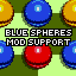

# Blue Spheres Sprite Mod Support

Adds support for sprite modding related to gameplay elements of Special Stages Blue Spheres, and also makes a few minor improvements.

Enable this mod to run other sprite mods.

## List of features:

* Suit up the HUD the way you want it, or, just refresh the sprites.

* Any spheres can be replaced with PNG/BMP sprites. Including custom spheres from other mods.

* Ground horizont also supports PNG sprite modding, and also adds horizont for Classic style.

* Custom customizable framerate for character sprites.

* An option to optimize the rendering of spheres behind the screen.

## How to use:

This framework is similar to how Data Select Sprite Mod Support works. Therefore, for those who have previously worked with it, it will not be difficult to figure out how this one works.

For an example of usage, check the folders __Blue Sphere Sprite Mod Support - EXAMPLE 1__ и __Blue Sphere Sprite Mod Support - EXAMPLE 2__, included in the archive with the mod. The resources for the change are kindly provided in the folder __Blue Sphere Sprite Mod Support - ASSETS__.

## FAQ:

Q. I noticed a bug, where can I contact?  
A. Contact me in the comments of Gamebanana, GitHub issues, or via Discord on the Sonic 3 A.I.R modding server. Try to describe the problem in more detail.

Good luck in creating your skins!